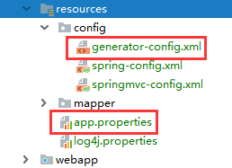
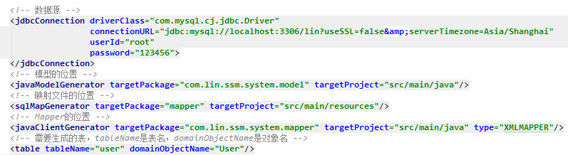
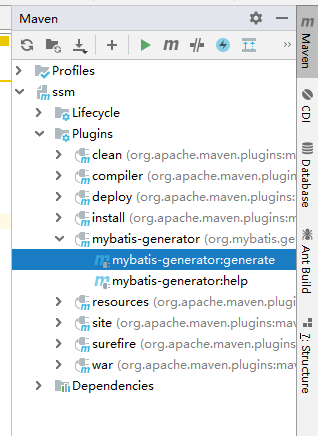
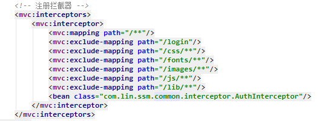
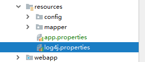
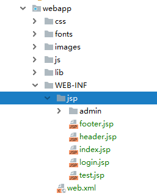
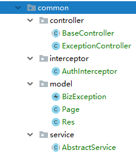

# 所需环境

jdk8、Tomcat9、IDEA、Maven、MySQL

# MySQL测试环境

用户名：root

密码：123456

数据库名：lin

表结构：

```
CREATE TABLE `user` (
  `user_id` int(11) NOT NULL AUTO_INCREMENT,
  `username` varchar(255) DEFAULT NULL,
  `password` varchar(255) DEFAULT NULL,
  PRIMARY KEY (`user_id`)
) ENGINE=InnoDB AUTO_INCREMENT=4 DEFAULT CHARSET=utf8;
```

# 数据源配置

有两个地方需要修改数据库配置信息，分别是`app.properties`和`generator-config.xml`



# MyBatis自动生成代码插件

如果需要使用自动生成代码插件，需要在`generator-config.xml`文件里配置相关数据，文件里都有注释，可视情况配置



配置完成后，可在右边的Maven对话框中双击`mybatis-generator:generate`进行自动生成



# 拦截器

拦截器默认在`com.lin.ssm.common.interceptor.AuthInterceptor`类，如果session里没有user属性，则会跳转到`/login`，如果不希望被拦截，请注释`springmvc-config.xml`文件里的`<mvc:interceptors>`标签



# log4j配置

log4j在resources下的`log4j.properties`文件下配置，配置说明在注释里



# 前端页面

jsp文件位置在`webapp/WEB-INF/jsp`目录下，里面内置了Layui框架的页面，如果需要用自己的页面，删除jsp文件和静态资源文件即可



# common包文件介绍



- BaseController：所有的Controller都可以继承这个BaseController，可以在里面写一些公共的属性或者方法
- ExceptionController：全局异常处理，抛出的异常都会在里面处理
- AuthInterceptor：拦截器
- BizException：自定义业务异常
- Page：分页对象，存放分页信息
- Res：固定格式的响应信息，ajax请求时可以通过该对象进行返回
- AbstractService：公共服务类，一些公共的方法已经继承在该类上，普通的服务类继承该类就可以使用基本的增删改查功能了